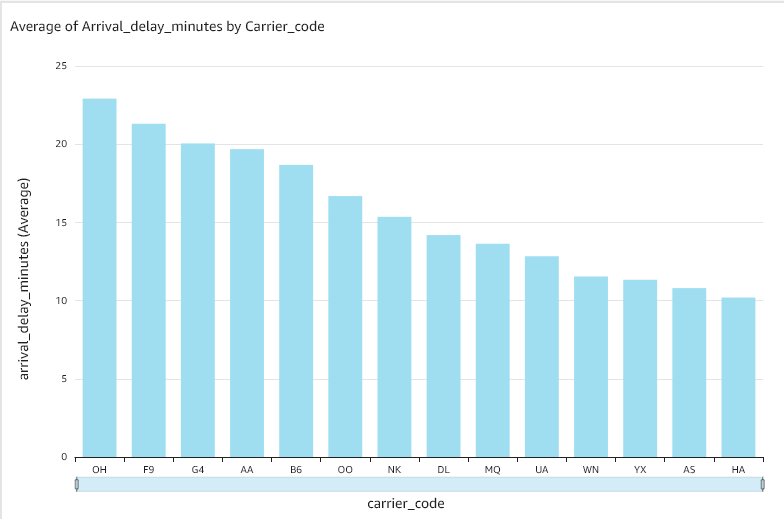
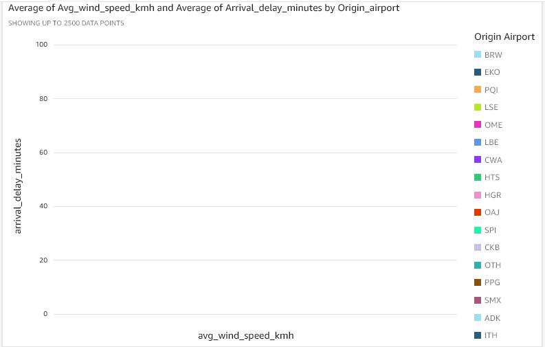
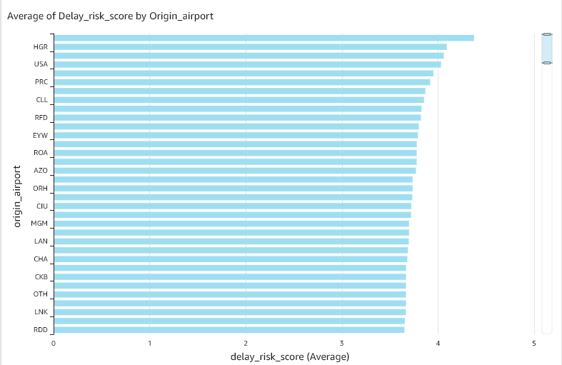

# AWS Flight Delay Weather Pipeline

A production-grade batch data pipeline on AWS that ingests US domestic flight delay data and weather observations, transforms them using dbt, and surfaces insights via Amazon QuickSight.

## Problem Statement

Which weather conditions most strongly correlate with flight delays, at which airports, and in which months? This pipeline answers that question using real FAA/BTS on-time performance data joined with NOAA weather observations for 20 major US airports.

## Architecture

```
BTS On-Time Data (free CSV)     NOAA NWS API (free)      Airport Reference CSV
        ↓                               ↓                         ↓
Lambda (monthly)              Lambda (daily)              One-time seed script
        ↓                               ↓                         ↓
S3 raw/flights/               S3 raw/weather/             S3 static/airports/
        ↓                               ↓                         ↓
                    Glue Crawler → Glue Catalog
                              ↓
                    dbt on Athena
                    stg_flights + stg_weather → fct_delay_weather
                              ↓
                    S3 curated/ (592k rows)
                              ↓
              Athena (ad-hoc) + QuickSight (dashboard)
```

## Tech Stack

| Layer | Technology |
|-------|-----------|
| Infrastructure | Terraform |
| CI/CD | GitHub Actions + AWS OIDC |
| Ingestion | AWS Lambda + EventBridge |
| Storage | Amazon S3 (data lake) |
| Catalog | AWS Glue |
| Transformation | dbt + Amazon Athena |
| Serving | Amazon Athena + QuickSight |
| Testing | Pytest (10 unit tests) + dbt tests (14 tests) |
| Language | Python 3.12 |

## Data Sources

- **BTS On-Time Performance** — Bureau of Transportation Statistics, free, monthly CSV. Every domestic US flight with actual delay minutes, carrier, origin, destination.
- **NOAA NWS API** — National Weather Service, free, no API key required. Daily weather observations for 20 major US airports.
- **OurAirports** — Free airport reference CSV with coordinates, IATA codes, and classifications.

## dbt Models
```
raw layer (S3)
    ↓
stg_flights    — cleans BTS data, renames columns, handles nulls
stg_weather    — flattens NOAA JSON, derives wind/visibility severity
    ↓
fct_delay_weather  — joins flights + weather, computes delay_risk_score (0-10)
dim_airports       — US airport reference dimension (872 airports)
```

## Dashboard

Three charts built in Amazon QuickSight:

1. **Average arrival delay by carrier** — OH and F9 have highest delays (~23 min), HA lowest (~10 min)


2. **Wind speed vs arrival delay scatter** — correlation between weather severity and delays by airport


3. **Delay risk score by origin airport** — composite score combining weather severity and actual delays



## Key Findings (March 2025)

- 592,301 non-cancelled domestic flights analyzed
- OH (Envoy Air) and F9 (Frontier) have the highest average arrival delays at ~23 minutes
- HA (Hawaiian Airlines) has the lowest average delay at ~10 minutes
- HGR (Hagerstown Regional) has the highest delay risk score

## Repository Structure
```
├── terraform/          # All AWS infrastructure as code
├── lambda/
│   ├── bts_downloader/ # Monthly BTS flight data ingestion
│   └── noaa_fetcher/   # Daily NOAA weather ingestion
├── dbt/
│   ├── models/
│   │   ├── staging/    # stg_flights, stg_weather
│   │   └── marts/      # fct_delay_weather, dim_airports
│   └── tests/          # schema.yml with 14 data quality tests
├── tests/              # Pytest unit tests (10 tests)
├── scripts/            # Airport seed script
└── .github/workflows/  # CI/CD (pr_checks + deploy)
```

## CI/CD

Every pull request runs:
- `terraform validate` + `terraform plan`
- `pytest` (10 unit tests)
- `black` + `flake8` linting

Every merge to main runs:
- `terraform apply` (infrastructure updates)
- Lambda function deployment

Authentication uses AWS OIDC — no long-lived credentials stored anywhere.

## How to Deploy
```bash
# 1. Clone the repo
git clone https://github.com/Narayanprasai/aws-flight-delay-pipeline.git
cd aws-flight-delay-pipeline

# 2. Configure AWS credentials
aws configure --profile personal

# 3. Create Terraform state bucket
aws s3api create-bucket \
  --bucket flight-pipeline-tfstate-YOUR_ACCOUNT_ID \
  --region ap-northeast-1 \
  --create-bucket-configuration LocationConstraint=ap-northeast-1

# 4. Deploy infrastructure
cd terraform
terraform init -backend-config="profile=personal"
terraform apply -var="aws_profile=personal"

# 5. Seed airport data
python scripts/seed_airports.py

# 6. Trigger initial data load
aws lambda invoke --function-name flight-pipeline-bts-downloader \
  --payload fileb://payload.json response.json
aws lambda invoke --function-name flight-pipeline-noaa-fetcher \
  response_noaa.json

# 7. Run dbt models
cd dbt
dbt run
dbt test
```

## Sample Athena Queries
```sql
-- Top 10 routes with highest average delay
SELECT
  origin_airport,
  destination_airport,
  AVG(arrival_delay_minutes) AS avg_delay,
  COUNT(*) AS flight_count
FROM fct_delay_weather
WHERE arrival_delay_minutes > 0
GROUP BY origin_airport, destination_airport
ORDER BY avg_delay DESC
LIMIT 10;

-- Delay by wind severity
SELECT
  wind_severity_score,
  AVG(arrival_delay_minutes) AS avg_delay,
  COUNT(*) AS flight_count
FROM fct_delay_weather
WHERE wind_severity_score IS NOT NULL
GROUP BY wind_severity_score
ORDER BY wind_severity_score;

-- Carriers with most weather-related delays
SELECT
  carrier_code,
  AVG(weather_delay_minutes) AS avg_weather_delay,
  COUNT(*) AS flights
FROM fct_delay_weather
WHERE weather_delay_minutes > 0
GROUP BY carrier_code
ORDER BY avg_weather_delay DESC;
```

## Cost

| Service | Monthly Cost |
|---------|-------------|
| Lambda | Free tier |
| EventBridge | Free tier |
| S3 | ~$1 |
| Glue | ~$2 |
| Athena | ~$0.50 |
| Redshift Serverless | Paused |
| **Total** | **~$4/month** |

## Certifications

- AWS Certified Data Engineer Associate (DEA-C01)
- AWS Certified Machine Learning Associate (MLA-C01)